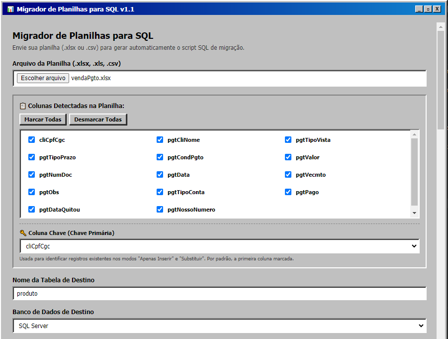
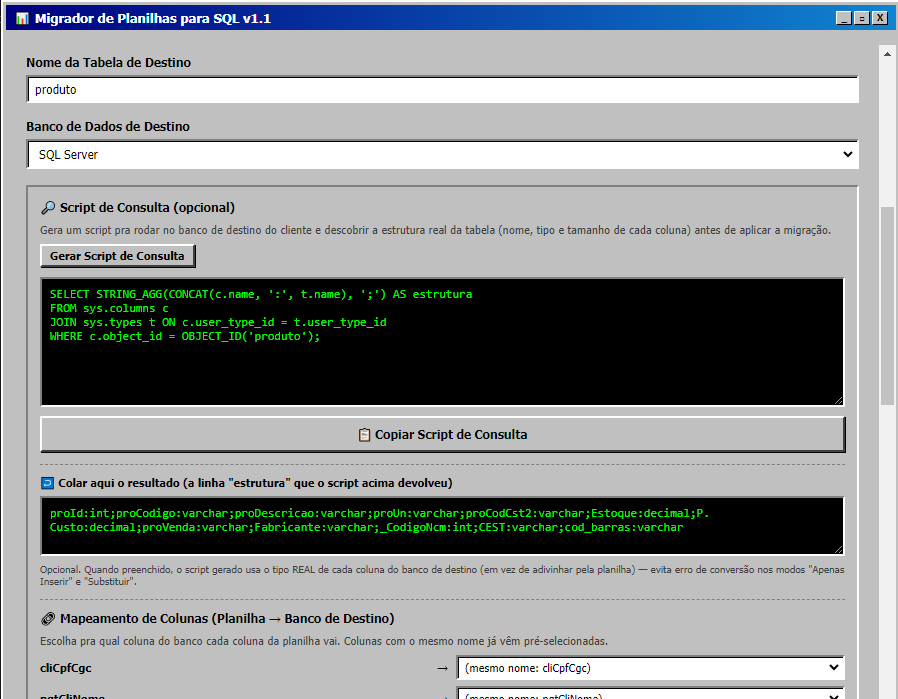
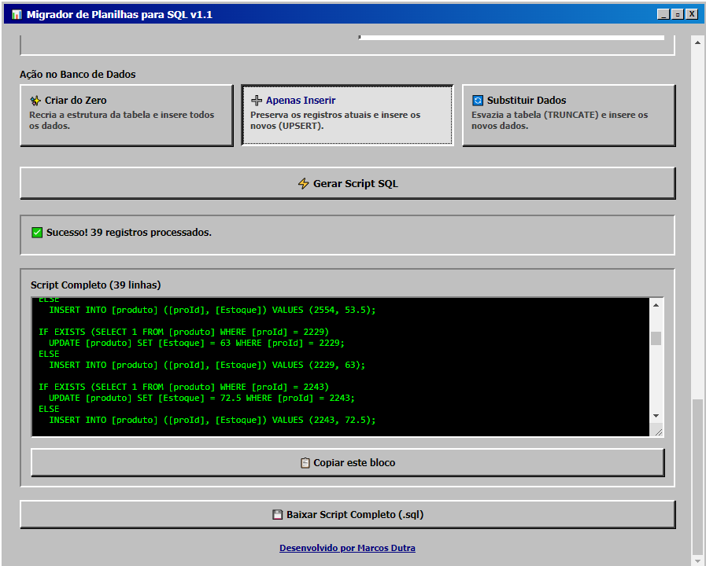

# 💾 Migrador de Planilhas para SQL

Aplicativo desktop que transforma planilhas Excel/CSV em scripts SQL prontos para migração de dados — sem precisar escrever uma linha de `INSERT` na mão.

> Feito para resolver um problema real do dia a dia: migrar dados de clientes entre sistemas diferentes (ERPs, bancos legados, planilhas soltas) de forma rápida, segura e sem depender de ferramentas pagas de ETL.

## ✨ Funcionalidades
- 🎨 **Interface Vintage / Retrô (Windows 98)** — design icônico com estilo clássico dos sistemas operacionais dos anos 90 para uma experiência nostálgica e diferenciada
- 📤 **Upload de planilha** (`.xlsx`, `.xls`, `.csv`) com detecção automática das colunas
- 🎯 **Seleção de colunas** — escolha exatamente o que entra na migração
- 🔑 **Coluna chave configurável** — define qual coluna identifica um registro único
- 🗄️ **3 bancos suportados** — SQL Server, MySQL/MariaDB e PostgreSQL
- ⚙️ **3 modos de migração**:
  - **Criar do Zero** — recria a tabela e insere tudo
  - **Apenas Inserir** — faz UPSERT (preserva o que já existe, insere o que é novo)
  - **Substituir Dados** — limpa a tabela e insere os dados atualizados
- 🔎 **Script de consulta** — gera automaticamente um SQL para rodar no banco de destino e descobrir a estrutura real da tabela (colunas e tipos), sem precisar de conexão direta
- 🔗 **Mapeamento de colunas** — liga colunas da planilha a colunas com nomes diferentes no banco de destino (ex: `Id` → `cliId`)
- 🧠 **Tipagem inteligente** — detecta datas reais, protege códigos com zero à esquerda (NCM, CEST, código de barras) e usa os tipos reais do banco quando informados
- 📦 **Scripts em blocos** — divide migrações grandes em blocos copiáveis separadamente, cada um funcionando de forma independente
- 🛡️ **Resiliente a erros** — se uma linha falhar, o banco registra o erro e segue para as próximas, em vez de travar a migração inteira
- 🖥️ **App desktop nativo** (Windows) via Electron, com splash screen e instalador próprio

## 🖼️ Capturas de tela

  

## 🛠️ Tecnologias

- **Backend:** Node.js + Express
- **Leitura de planilhas:** [SheetJS (xlsx)](https://sheetjs.com/)
- **Upload:** Multer
- **Desktop:** Electron
- **Frontend:** HTML/CSS/JS puro (sem framework), com um visual retrô inspirado no Windows 98

## 🚀 Rodando localmente

```bash
# instalar dependências
npm install

# rodar como app web (abre em http://localhost:3000)
npm start

# rodar como app desktop (Electron)
npm install --save-dev electron electron-builder
npm run dev
```

## 📦 Gerando o instalador (.exe)

```bash
npm run build
```

O instalador é gerado em `dist/`, pronto para distribuir — quem for instalar não precisa ter Node.js nem conhecimento técnico.

## 📁 Estrutura do projeto

```
migrador-web/
├── main.js          # Processo principal do Electron (janela, splash, IPC)
├── preload.js        # Ponte segura entre a janela e o processo principal
├── server.js          # Backend Express: leitura da planilha e geração do SQL
├── package.json
└── public/
    ├── index.html    # Interface do app
    ├── splash.html    # Tela de abertura
    ├── icon.ico
    └── icon.png
```

## 👤 Autor

**Marcos Dutra**
Desenvolvedor Full Stack  — sistemas ERP e módulos fiscais (NF-e, NFC-e, NFS-e, CT-e)

🔗 [devmarcosdutra.netlify.app](https://devmarcosdutra.netlify.app)

## 📄 Licença

Este projeto está sob a licença MIT — sinta-se livre para usar, estudar e adaptar.
